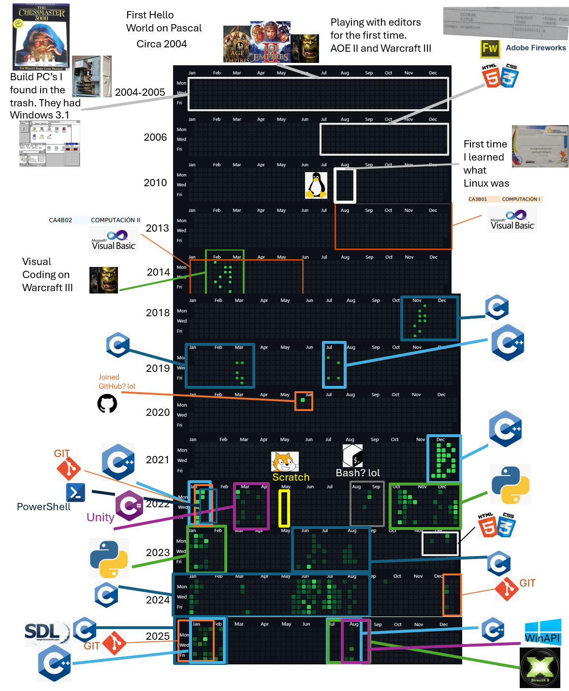

# 👋 Hey there, I'm Spike

Welcome to my GitHub profile! I'm a programmer interested in low-level systems and graphics. I build things, break things, and occasionally document the process.  
Addicted to physical books 📚✨

---

## 💻 Tech Stack

- 🧠 Languages: `C`, `Python`, `C++`
- 🛠 Tools: `Neovim`, `Visual Studio`, `Git`, `Visual Studio Code`
- 🖼 APIs & Frameworks: `WinAPI`, `DirectX`, `SDL`
- 🕹 Currently exploring: `Modern C++`, `Game Engine Architecture`, `Low-Level Systems`, `Graphics APIs`

---

## 🧰 Toolbox

  
  
  

---

## 🔭 Projects Worth Clicking

| Project | Description | Tech |
|--------|-------------|------|
| [🔧 3drenderer](https://github.com/Hersonrock/Pikuma) | A 3D software renderer using SDL2 | `C`, `SDL` |
| [🌐 FileSplitter](https://github.com/Hersonrock/The_Linux_Programming_Interface/tree/main/ch4/reelseiden) | Splits files using raw Linux syscalls | `C`, `Linux` |
| [🎮 C-Study Exercises](https://github.com/Hersonrock/C-AModernApproach) | Structured exercises from *C: A Modern Approach* | `C` |

---

## 📈 GitHub Stats

---

## 🧠 Currently Learning

- [ ] WinAPI — for my stubborn goal of understanding old Windows codebases
- [ ] Proper Modern C++ practices (RAII, smart pointers, etc.) — because, might as well
- [ ] How not to drown in a massive 2005 MMO codebase
- [ ] How to actually learn effectively, not just hoard PDFs

---

## 🤝 Let's Connect

- 💼 <a href="mailto:hersonrockproject@gmail.com">Email</a>

---

> *“We don’t find beauty. We make the world beautiful by paying attention.” – [Ralph Ammer](https://www.youtube.com/watch?v=ZqlTSCvP-Z0)*
---

## 🌈Life with Computers and programming (it actually goes even farther back but I dont remember that much)

